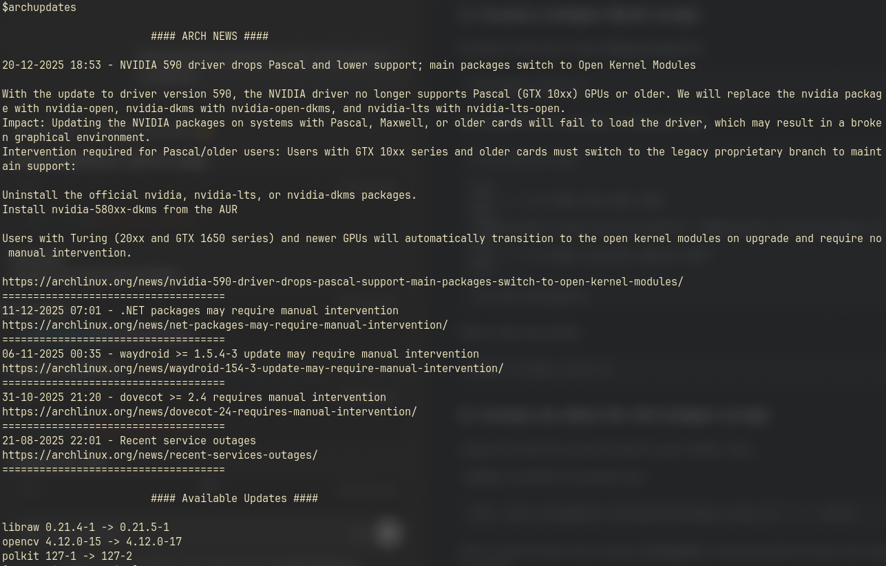

# Suggested setup for archnews-rss.py for daily usage



This simple python programme provides the latest news article from the arch wiki RSS feed as well as the latest five titles and URLs. 

Simply running the python script works but the below suggested setup  provides a handy way to check for any issues requiring manual intervention while checking for updates at the same time. 

This assumes you have the `pacman-contrib` package installed, which provides the `checkupdates` utility. 

## 1. Download scripts and requirements
Download `archnews-rss.py` and `requirements.txt` from the repo. Alternatively, clone the whole repo to get all  convenience scripts.

Cloning the repo:
```
git clone https://github.com/gsebos/python-scripts.git
```

## 2. Install requirements

a. cd into the folder where the script is
```
cd python-scripts 
```

b. create a venv environment, here called `venv`
```
python3 -m venv venv 
```

c. activate the virtual environment
```
source venv/bin/activate
```

d. install python requirements
```
pip install -r requirements.txt
```

## 3. Create a  helper Bash script

Example script (here called `helper_script.sh`):

```
vim helper_script.sh
```

then copy this as an example or write your own:
```
#!/usr/bin/env bash

echo
echo -e "\t\t\t#### ARCH NEWS ####"
echo
"$HOME/python-scripts/venv/bin/python3" "$HOME/python-scripts/archnews-rss.py"
echo
echo -e "\t\t\t#### Available Updates ####"
echo

/usr/bin/checkupdates
```
Make script executable:
```
chmod +x helper_script.sh
```

## 4. Create an alias for the helper script
replace this with the actual full path to your helper script.

`.bashrc` provided as example here.

```
echo "alias archupdates='full/path/to/helper_script.sh'" >> ~/.bashrc 
```

Start a new terminal, now running `archupdates` should provide the latest arch news as well as the available packages to update.
